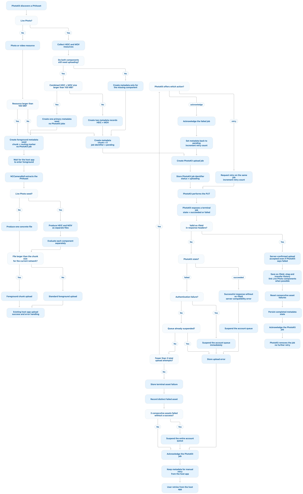

<!--
  - SPDX-FileCopyrightText: Nextcloud GmbH
  - SPDX-FileCopyrightText: 2026 Marino Faggiana
  - SPDX-License-Identifier: GPL-3.0-or-later
-->

# Background upload extension

The following diagram documents the complete background-upload flow, including asset discovery, Live Photo handling, foreground chunk routing, PhotoKit job creation, server-confirmed success, automatic retries, acknowledgements, and account-level suspension.

## Routing summary

- A regular photo or video up to 100 MB is uploaded by PhotoKit.
- A regular resource larger than 100 MB is stored as foreground metadata and handled by the host app.
- A complete Live Photo up to 100 MB in total creates separate PhotoKit jobs for its HEIC and MOV resources.
- A complete Live Photo larger than 100 MB in total creates one metadata seed; the host app later extracts and uploads both components.
- After foreground extraction, the host app recalculates the actual chunk requirement for every concrete file using the current network.

## PhotoKit result handling

- A valid `oc-fileid` confirms that Nextcloud committed the upload, even when PhotoKit reports the job as failed after an HTTP 204 response.
- A failed upload is attempted at most three times in total: the initial upload and two automatic retries.
- Authentication failures and successful responses without `oc-fileid` suspend the account queue immediately.
- Three consecutive terminal asset failures without an intervening success suspend the account queue.
- Terminal PhotoKit jobs are acknowledged only after their result has been persisted locally.
