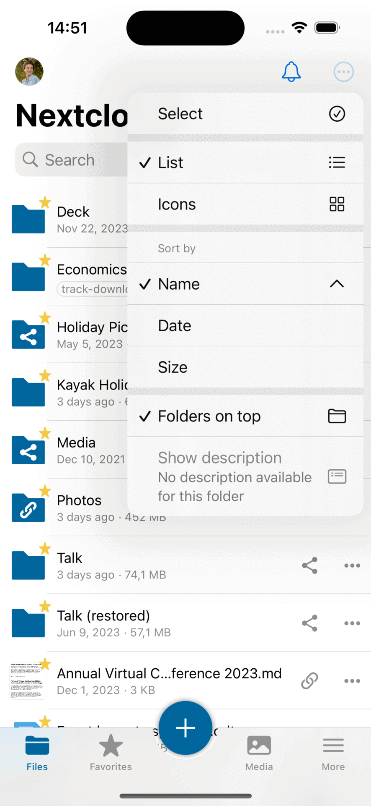

# [Nextcloud](https://nextcloud.com) iOS app 
[](https://github.com/nextcloud/ios/releases/latest) [](https://github.com/nextcloud/ios/actions/workflows/xcode.yml) [](https://github.com/nextcloud/ios/actions/workflows/lint.yml)
[](https://webchat.freenode.net/?channels=nextcloud-mobile)



[](https://itunes.apple.com/us/app/nextcloud/id1125420102)

Check out https://nextcloud.com and follow us on [twitter.com/nextclouders](https://twitter.com/nextclouders)

## How to contribute
If you want to [contribute](https://nextcloud.com/contribute/) to Nextcloud, you are very welcome:

- our forum at https://help.nextcloud.com/c/clients/ios
- for translations of the app on [Transifex](https://www.transifex.com/nextcloud/nextcloud/dashboard/)
- opening issues and PRs (including a corresponding issue)

## Contribution Guidelines & License

[GPLv3](LICENSE.txt) with [Apple app store exception](COPYING.iOS).

Nextcloud doesn't require a CLA (Contributor License Agreement). The copyright belongs to all the individual contributors. Therefore we recommend that every contributor adds following line to the header of a file, if they changed it substantially:

```
@copyright Copyright (c) <year>, <your name> (<your email address>)
```

Please read the [Code of Conduct](https://nextcloud.com/code-of-conduct/). This document offers some guidance to ensure Nextcloud participants can cooperate effectively in a positive and inspiring atmosphere, and to explain how together we can strengthen and support each other.

More information how to contribute: [https://nextcloud.com/contribute/](https://nextcloud.com/contribute/)

## Start contributing

You can start by forking this repository and creating pull requests on the develop
branch. Maybe start working on [starter issues](https://github.com/nextcloud/ios/labels/good%20first%20issue). 

Easy starting points are also reviewing [pull requests](https://github.com/nextcloud/ios/pulls)

### Xcode 16 Project Setup

#### Dependencies

In order to build the project in Xcode you will also need a file `GoogleService-Info.plist` at the root of the repository which contains the Firebase configuration. For development work you can use a mock version found [here](https://github.com/firebase/quickstart-ios/blob/master/mock-GoogleService-Info.plist).

### Creating Pull requests

#### DCO Signoff

Nextcloud enforces the [Developer Certificate of Origin (DCO)](https://developercertificate.org/) on Pull Requests. It requires your commit messages to contain a Signed-off-by line with an email address that matches your GitHub account.

##### How to Sign off

The DCO is a way for contributors to certify that they wrote or otherwise have the right to submit the code they are contributing by adding a Signed-off-by line to commit messages.

```
My Commit message

Signed-off-by: Random Contributor <random@contributor.dev>
```

Git even has a `-s | --signoff` command line option to append this to your commit messages automatically.

## Support

If you need assistance or want to ask a question about the iOS app, you are welcome to [ask for support](https://help.nextcloud.com/c/clients/ios) in our Forums. If you have found a bug, feel free to [open a new Issue on GitHub](https://github.com/nextcloud/ios/issues). Keep in mind, that this repository only manages the iOS app. If you find bugs or have problems with the server/backend, you should ask the [Nextcloud server team](https://github.com/nextcloud/server) for help!

## TestFlight 

Do you want to try the latest version in development of Nextcloud iOS ? Simple, follow this simple step

[Apple TestFlight](https://testflight.apple.com/join/RXEJbWj9)

## Testing

**Note: If a unit or integration test exclusively uses and tests NextcloudKit functions and components, then add that test to the NextcloudKit project instead. NextcloudKit is used in many other projects as an API, and it's better if such tests are located there.**

### Unit Tests

There are currently no prerequisites for unit testing.
Mock everything which is not needed. 

### Integration Tests

In `TestConstants.swift` you must specify your credentials for the server you want to test against.
For locally running tests and in the GitHub actions we use [this shallow CI server image](https://github.com/nextcloud/docker-ci/pkgs/container/continuous-integration-shallow-server).
Due to technical constraints the GitHub actions rely on a bare metal installation of Nextcloud on the runner in difference to local tests which can leverage much cleaner and reliable Docker containers.

Currently, you still need to launch the server manually once before running any tests locally.
This project comes with a convenience script to do so, see or run [Tests/Server.sh](Tests/Server.sh).
**Please familiarize yourself with its content before running it** to avoid unintended removal of a container named like in the script. 

The same instance is reused for all tests.
A long term goal is to automatically create and discard container _per test_ to ensure maximum test isolation and a clean test environment.
Note that plain HTTP is used in this case to circumvent certificate issues and simplify the sign-in flow in automation.

### UI Tests

UI tests also require a Nextcloud server to test against just like integration tests.
**Important**: Additionally, UI tests assume your test device (regardless whether physical or Simulator) is set to **US English**.
This is required because in some parts of the user interface the automation has no other choice than to rely on localized texts for control.
